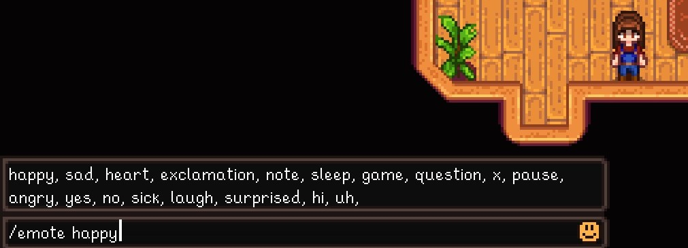
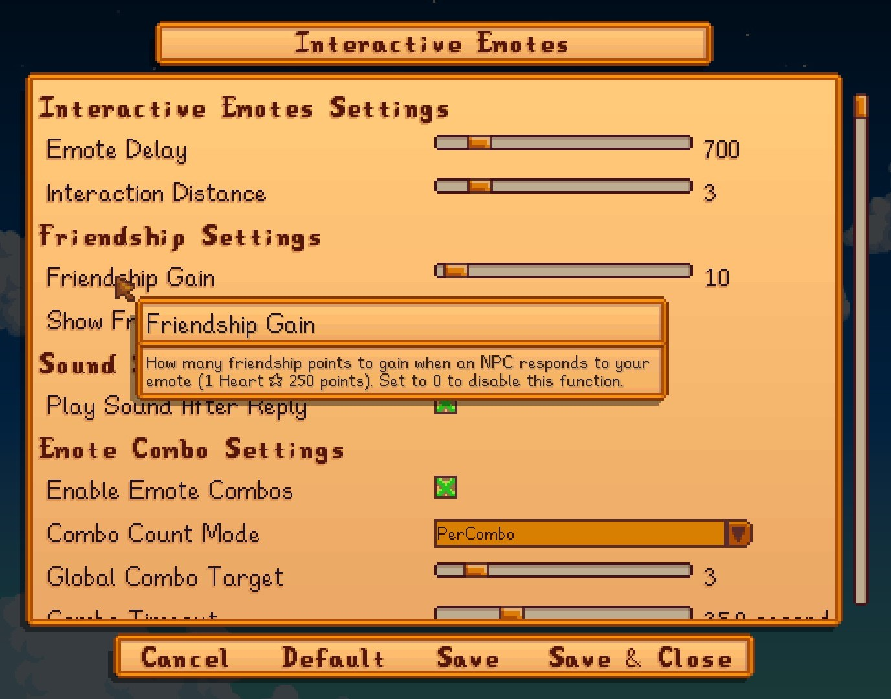
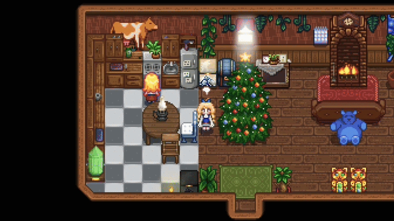

**_Interactive Emote_** is a [Stardew Valley](https://www.nexusmods.com/stardewvalley/mods/33624) mod that allows you to interact with nearby NPCs using emotes Whether it's villagers, your horse, your dog, or even your cat 
when you perform an emote, the nearby NPCs will respond with their own expressions   

  

  

## Contents
- [Contents](#contents)
- [Install](#install)
- [Features](#features)
- [How to Use](#how-to-use)
- [Configure](#configure)
- [Compatibility](#compatibility)
- [Documentation \& Guides](#documentation--guides)

## Install
1. Install the latest version of SMAPI.
2. Unzip the mod folder into Stardew Valley/Mods.
3. Run the game using SMAPI.

## Features

* Interact with nearby NPCs using emotes, When the player performs an emote near an NPC — whether it's a villager, horse, dog, or cat — the NPC will react with an emote of their own.
* Relationship based reactions, NPCs with higher friendship levels will respond differently emote.
* Increase relationship points when using an emote.
* NPCs respond differently when the same emote is used repeatedly. (New feature in version 1.2.0)
* All feature can be disable in config file or in Generic Mod Config Menu
* Customize your conditions by editing the JSON file according to [this guide](#json-customization). **_(Note: It's still a bit tricky at this moment.)_**
  
## How to Use

* Use the emote menu by pressing the **Y** key on PC, or another key if you've customized the controls.
* Use the in-game chat to type the command `/emote <emote>` (e.g., `hello`, `hi`, `laugh`), like this one below.

  >  

## Configure

If you have a [Generic Mod Config Menu](https://www.nexusmods.com/stardewvalley/mods/5098), you can click the cog button (⚙) on the title screen
or the "mod options" button at the bottom of the in-game menu to configure the mod.
> 

## Compatibility

1. Compatible with Stardew Valley 1.5.6+
2. Should work on mobile (I think).
3. Works with SVE, Ridgeside, and other modded NPCs, but only Villager NPCs (***Technically, it works with all NPCs — but pets and other animals might respond a bit strangely.***)
4. Multiplayer safe (***Never test yet but it should work （〃｀ 3′〃）***)

## Documentation & Guides

***<strong style="color: red;">If you are the translator or someone who want to customize this mod you should read these Docs</strong>***

* **[Translation Guide](docs/TRANSLATION_GUIDE.md)** — Learn how to translate the mod into your language and use special tokens (`@`, `%farm%`, `^`, etc.).
* **[JSON Customization Guide](docs/CUSTOMIZATION_GUIDE.md)** — A complete, step-by-step tutorial on how to create custom reactions, master conditions, and set up emote combos.  
  
       
      

  <i><b>At least enjoy My mod (〜￣▽￣)〜</b></i>
  

