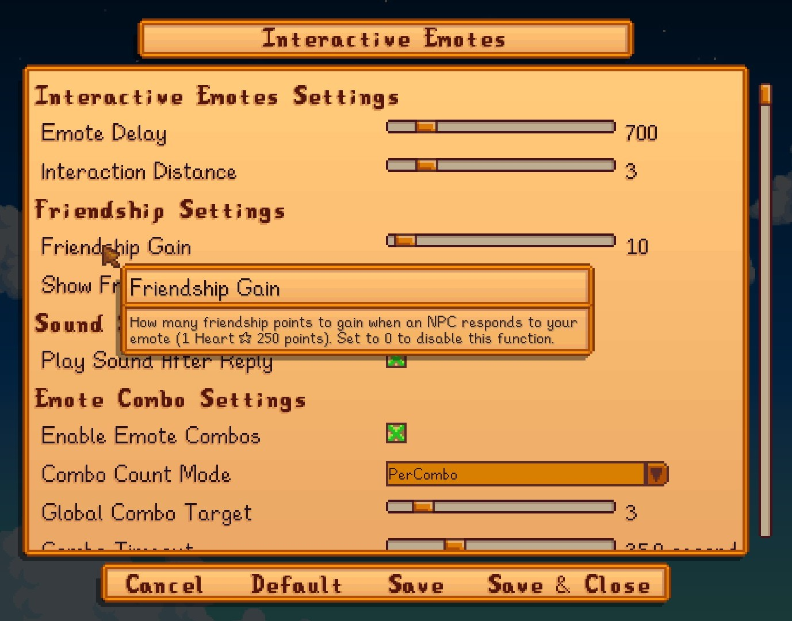

**_Interactive Emote_** is a [Stardew Valley](https://www.nexusmods.com/stardewvalley/mods/33624) mod that allows you to interact with nearby NPCs using emotes Whether it's villagers, your horse, your dog, or even your cat 
when you perform an emote, the nearby NPCs will respond with their own expressions<br><br><br>
<p align="center">
  
</p><br><br>

## Contents
* [Install](#install)
* [Features](#features)
* [Configure](#configure)
* [Compatibility](#compatibility)
* [Translation Guide](#translation-guide)
* [JSON Customization](#json-customization)

## Install
1. Install the latest version of SMAPI.
2. Unzip the mod folder into Stardew Valley/Mods.
3. Run the game using SMAPI.

## Features

* Interact with nearby NPCs using emotes, When the player performs an emote near an NPC — whether it's a villager, horse, dog, or cat — the NPC will react with an emote of their own.
* Relationship based reactions, NPCs with higher friendship levels will respond differently emote.
* Increase relationship points when using an emote.
* NPCs respond differently when the same emote is used repeatedly. (New feature in version 1.2.0)
* All feature can be disable in config file or in Generic Mod Config Menu
* Customize your conditions by editing the JSON file according to [this guide](#). **_(Note: It's still a bit tricky at this moment.)_**
<br><br>
## How to Use

* Use the emote menu by pressing the **Y** key on PC, or another key if you've customized the controls.
* Use the in-game chat to type the command `/emote <emote>` (e.g., `hello`, `hi`, `laugh`), like this one below.


  >  


## Configure

If you have a [Generic Mod Config Menu](https://www.nexusmods.com/stardewvalley/mods/5098), you can click the cog button (⚙) on the title screen
or the "mod options" button at the bottom of the in-game menu to configure the mod.
> 


## Compatibility

1. Compatible with Stardew Valley 1.5.6+
2. Should work on mobile (I think).
3. Works with SVE, Ridgeside, and other modded NPCs, but only Villager NPCs (***Technically, it works with all NPCs — but pets and other animals might respond a bit strangely.***)
4. Multiplayer safe (***Never test yet but it should work （〃｀ 3′〃）***)


## Translation Guide

This guide will explain how to translate the Interactive Emotes mod into different languages, including how to use special tokens to create dynamic dialogue.

**Example:**
```json
"greeting.hi.normal1": "Hello. How are you today?"
```
* **"greeting.hi.normal1"** is the **Key:** This is an identifier that the code uses to reference the text. **You must never change this Key.**
* **"Hello. How are you today?"** is the **Value:** This is the text that will be displayed in the game. This is the part you need to **translate into your language.**

> **How to Add a New Language:** To add a new language (e.g., Japanese), simply make a copy of `default.json`, rename it to `ja.json`, and then begin translating the text within that new file.

---

### **Special Tokens & Syntax**

Within the text values, you can use these special tokens to display dynamic game data:

|        Token       | Description                                                                  | Example in JSON                                         | Example In-Game Result                                                                  |
|:------------------:|------------------------------------------------------------------------------|---------------------------------------------------------|-----------------------------------------------------------------------------------------|
| `@`                | Replaced with the **player's name**.                                         | `"Hello, @!"`                                           | `Hello, Shiro!`                                                                         |
| `%farm%`           | Replaced with the player's **farm name**.                                    | `"How is %farm% farm?"`                                 | `How is Echo farm?`                                                                     |
| `%favorite_thing%` | Replaced with the player's **favorite thing**.                               | `"Let's talk about %favorite_thing%."`                  | `Let's talk about Pizza.`                                                               |
| `%pet%`            | Replaced with the player's **pet's name**.                                   | `"How is %pet% doing?"`                                 | `How is Mochi doing?`                                                                   |
| `%spouse%`         | Replaced with the speaking NPC's **spouse's name** (usually the player).     | `"Thank you, %spouse%."`                                | `Thank you, Shiro.`                                                                     |
| `^`                | **Gender Token**<br>`text_for_male_player^text_for_female_player`            | `"He's a nice guy.^She's a nice gal."`                  | `He's a nice guy.` (if player is male)`She's a nice gal.` (if player is female)         |
| `\|`               | **Dialogue Splitter Token**<br>Splits long text to be displayed in sequence. | `"The weather is nice today.\|Shall we go for a walk?"` | Shows "The weather is nice today." first, then "Shall we go for a walk?" after a pause. |

### **A Note on Spacing**

Spacing is important for making sentences appear natural.

* **Around standard tokens (`@`, `%farm%`):** Spacing works just like a normal sentence. The token will be replaced perfectly with the value.
    * **Good Example ✅:** `"Hello, @! The weather is nice."` -> `Hello, Link! The weather is nice.`
    * **Bad Example ❌:** `"Hello, @ ! The weather is nice."` -> `Hello, Link ! The weather is nice.` (This will result in an extra space before the `!`)

* **Around the Dialogue Splitter Token (`|`):**
    * This token splits the string exactly where it is placed. For consistency, it is best to write it without spaces on either side.
        * **Recommended:** `"First sentence.|Second sentence."`

---

### **Tips for Translators**

* **Never Change the Keys:** To reiterate, do not change the text on the left side of the colon (`:`).
* **Use Other Files as a Reference:** If you are unsure how to use a token, you can always open `default.json` or `th.json` to see examples.

Thank you for helping to translate this mod ♪(´▽｀) <br><br><br><br>


## JSON Customization

This guide provides a comprehensive, step-by-step tutorial on how to customize every aspect of character reactions using the mod's JSON files. This guide is designed for everyone, from beginners to experienced users.

### **Getting Started: Tools and File Locations**

Before you begin, it's highly recommended to use a code editor like **Visual Studio Code (VS Code)**. It's free and will provide syntax highlighting, error checking, and code formatting, which makes editing JSON files much easier.

You can find the customization files in your game's directory:
* `Mods/InteractiveEmotes/assets/reactions.json`
* `Mods/InteractiveEmotes/assets/combos.json`
* `Mods/InteractiveEmotes/i18n/default.json` (for English dialogue)

---

## **1. Core Concepts: Emotes, Rules, and Actions**

The entire system is built on three core concepts:

* **Emotes:** The top level of the JSON files is the name of the player's emote (e.g., `"heart"`). This is the trigger. You can create rules for any of the game's standard emotes.
* **Rules:** Inside each emote is a list of rules (`"Reactions": []` or `"ComboReactions": []`). The mod checks these rules **from top to bottom** and uses the **first rule that matches** the current situation. This is the most important principle to remember.
* **Actions:** Every rule must have an `Action` that tells the character what to do (show an emote, display text, or both).

---

## **2. Your First Custom Reaction (Step-by-Step)**

Let's create a set of reactions for the **`"hi"`** emote in `reactions.json`.

### **Step 2.1: The Simplest Rule (A Catch-All)**
A "catch-all" rule has no conditions and will trigger if no other specific rule matches. It's great as a default fallback.

```json
"hi": {
  "Reactions": [
    {
      "Action": {
        "Emote": "happy"
      }
    }
  ]
}
```
* **What this does:** When you use the "hi" emote, any character will respond with the "happy" emote.

### **Step 2.2: Adding Dialogue**
Let's make them say something. We do this by adding a `DisplayText` key. The value is a "translation key" that links to your dialogue file.

**In `reactions.json`:**
```json
"hi": {
  "Reactions": [
    {
      "Action": {
        "Emote": "happy",
        "DisplayText": "greeting.generic"
      }
    }
  ]
}
```

**In `i18n/default.json`:**
You must add the corresponding key and the text you want to show.
```json
{
  "greeting.generic": "Hello there!"
}
```
* **What this does:** Now, when a character reacts, they will show the "happy" emote and a text bubble that says "Hello there!".

### **Step 2.3: Adding Randomness**
To make interactions feel less repetitive, you can provide a list of options for `Emote` and `DisplayText`. The mod will pick one at random each time.

**In `reactions.json`:**
```json
"hi": {
  "Reactions": [
    {
      "Action": {
        "Emote": ["happy", "blush"],
        "DisplayText": ["greeting.generic.1", "greeting.generic.2"]
      }
    }
  ]
}
```

**In `i18n/default.json`:**
```json
{
  "greeting.generic.1": "Hey, good to see you!",
  "greeting.generic.2": "Hi there, @!"
}
```
* **What this does:** Now, the character might show a "happy" emote and say "Hey, good to see you!", or they might show a "blush" emote and say "Hi there, [Your Name]!".

---

## **3. Mastering `Conditions`**

The `Conditions` object allows you to create highly specific rules. A rule will only trigger if **ALL** conditions inside its `Conditions` block are true.

### **By Specific Name**
* **Key:** `Name`
* **Type:** `string`
* **Description:** The rule only applies to the character with this exact name.
* **Example:**
    ```json
    {
      "Conditions": {
        "Name": "Abigail"
      },
      "Action": { "Emote": "game" }
    }
    ```

### **By Relationship Status**
* **Key:** `IsSpouse`
* **Type:** `boolean` (`true` or `false`)
* **Description:** Checks if the character is your spouse.
* **Example:**
    ```json
    {
      "Conditions": {
        "IsSpouse": true
      },
      "Action": { "Emote": "heart" }
    }
    ```

* **Key:** `IsDateable`
* **Type:** `boolean` (`true` or `false`)
* **Description:** Checks if the character is one of the bachelors or bachelorettes.
* **Example (for a dateable NPC who is NOT your spouse):**
    ```json
    {
      "Conditions": {
        "IsDateable": true,
        "IsSpouse": false
      },
      "Action": { "Emote": "blush" }
    }
    ```

### **By Friendship Level**
* **Key:** `FriendshipGreaterThanOrEqualTo`
* **Type:** `integer`
* **Description:** Triggers if friendship points are at or above this value (1 heart = 250 points).
* **Example (for 8+ hearts):**
    ```json
    {
      "Conditions": {
        "FriendshipGreaterThanOrEqualTo": 2000
      },
      "Action": { "Emote": "happy" }
    }
    ```

* **Key:** `FriendshipLessThan`
* **Type:** `integer`
* **Description:** Triggers if friendship points are below this value.
* **Example (for less than 2 hearts):**
    ```json
    {
      "Conditions": {
        "FriendshipLessThan": 500
      },
      "Action": { "Emote": "question" }
    }
    ```

### **By Character Type**
* **Key:** `CharacterType`
* **Type:** `string` or `array of strings`
* **Description:** Checks the general type of the character. Valid types are `"Villager"`, `"Pet"`, `"FarmAnimal"`, and `"Baby"`.
* **Example (for any animal):**
    ```json
    {
      "Conditions": {
        "CharacterType": ["Pet", "FarmAnimal"]
      },
      "Action": { "Emote": "happy" }
    }
    ```

### **By Pet Type**
* **Key:** `PetType`
* **Type:** `string`
* **Description:** A more specific check for pets. Valid types are `"Dog"`, `"Cat"`, `"Horse"`, and `"Turtle"` (for compatibility with some mods).
* **Example:**
    ```json
    {
      "Conditions": {
        "PetType": "Dog"
      },
      "Action": { "DisplayText": "animal.dog.happy1" }
    }
    ```

### **By World State (Season & Weather)**
* **Key:** `Season`, `Weather`
* **Type:** `string`
* **Description:** Checks the current season or weather.
    * **Seasons:** `"spring"`, `"summer"`, `"fall"`, `"winter"`
    * **Weather:** `"Sunny"`, `"Rainy"`, `"Windy"`, `"Stormy"`, `"Snowy"`
* **Example (a special greeting on a rainy Fall day):**
    ```json
    {
      "Conditions": {
        "Season": "fall",
        "Weather": "Rainy"
      },
      "Action": { "DisplayText": "greeting.rainy_fall" }
    }
    ```

---

## **4. The Rule Priority Principle (Very Important!)**

The mod checks rules from top to bottom. This means you **must** place your most **specific** rules **above** your more **general** rules.

#### **Incorrect Order ❌**
This will not work as intended. The first rule (the general one) will always be chosen, and the specific rule for friends will never be reached.
```json
"heart": {
  "Reactions": [
    {
      "Action": "question" // General rule is first
    },
    {
      "Conditions": { "FriendshipGreaterThanOrEqualTo": 2000 }, // Specific rule is second
      "Action": "heart"
    }
  ]
}
```

#### **Correct Order ✅**
The specific rule for high friendship is placed first. If that condition isn't met, the mod will then fall back to the general rule below it.
```json
"heart": {
  "Reactions": [
    {
      "Conditions": { "FriendshipGreaterThanOrEqualTo": 2000 }, // Specific rule is first
      "Action": "heart"
    },
    {
      "Action": "question" // General rule is the fallback
    }
  ]
}
```

---

## **5. Understanding Combos (`combos.json`)**

The `combos.json` file works exactly like `reactions.json`, but with one extra key:

* **`TriggerCount`**: An `integer` that specifies how many times you must perform the emote in a row to trigger the combo reaction.

**Example Combo Rule:**
```json
"happy": {
  "ComboReactions": [
    {
      "Conditions": { "FriendshipGreaterThanOrEqualTo": 1000 },
      "TriggerCount": 3,
      "Action": {
        "Emote": "blush",
        "DisplayText": "combo.happy.friend"
      }
    }
  ]
}
```
* **What this does:** If your friendship with an NPC is 4 hearts or more, and you use the "happy" emote 3 times in a row, they will respond with a "blush" emote and special dialogue.

---

## **6. Special Features & Syntax**

### **Special Animations (`anim_`)**
For more expressive reactions, you can trigger full-body animations instead of just an emote bubble.
* **How:** In the `Emote` property of an `Action`, add the prefix `anim_`.
* **Available Animations:** `"anim_laugh"`, `"anim_game"`, `"anim_exclamation"`, `"anim_sick"`
* **Example:**
    ```json
    {
      "Conditions": { "Name": "Abigail" },
      "Action": { "Emote": "anim_game" }
    }
    ```

### **Multi-Part Dialogue (`|`)**
You can make NPCs say longer things by splitting dialogue into multiple bubbles.
* **How:** In your `i18n/default.json` file, place a `|` character where you want the split to occur.
* **Example in `i18n/default.json`:**
    ```json
    "greeting.long": "Oh, hello there, @!|It's a beautiful day for farming, isn't it?"
    ```
* **In-Game Result:** The NPC will first show a bubble with "Oh, hello there, [Your Name]!", pause for a moment, and then show a new bubble with "It's a beautiful day for farming, isn't it?".<br><br><br>


<p align="center">
  <i><b>At least enjoy My mod (〜￣▽￣)〜</b></i>
  
</p>


